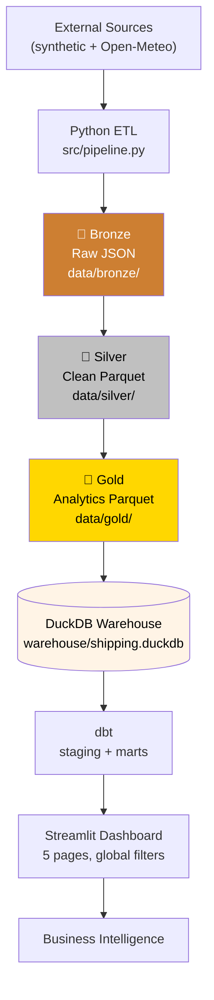

# Shipping Analytics Data Platform

[](https://github.com/Alan-Muk/ShippingDataPipeline/actions/workflows/ci.yml)
[](https://codecov.io/gh/Alan-Muk/ShippingDataPipeline)
[](https://www.python.org/downloads/)
[](https://github.com/astral-sh/ruff)
[](https://opensource.org/licenses/MIT)

> An end-to-end logistics analytics platform demonstrating modern data engineering practices.

This project simulates a **European shipping operation** — 100 customers across 30 EU cities, 4 warehouses, and 300 orders — and transforms raw operational data into interactive business intelligence. It's built the way production analytics platforms are built: medallion architecture, columnar storage, a real transformation layer with tests, a warehouse, and a dashboard.

Every stage is tested, every transform is documented, and the entire warehouse rebuilds in **under 15 seconds** with one command.

---

## Highlights

| | |
|---|---|
| **110 automated tests** | 93 pytest + 17 dbt, all green in CI |
| **~4,100 lines of Python** | Backend, tests, and dashboard |
| **5 dbt models** | Staging → marts, with lineage |
| **3.9:1 test-to-source ratio** | 1,356 test LOC vs 1,439 source LOC |
| **Python 3.11 / 3.12 / 3.13** | Tested matrix in GitHub Actions |
| **~10 second end-to-end** | Full pipeline from fetch to dashboard-ready |
| **Vectorized throughout** | Polars expressions, no Python loops in the hot path |
| **One command rebuild** | `make ci` runs lint + tests + dbt |

---

## Architecture



**The medallion pattern** separates concerns across three layers:

- **Bronze** preserves raw source data as timestamped JSON — the only ground truth.
- **Silver** applies type normalization and deduplication, stored as Parquet.
- **Gold** contains business-ready datasets (routes, risk scores) that the analytics layer consumes.

Full details in [`docs/architecture.md`](docs/architecture.md).

---

## Quick Start

```bash
# 1. Clone and install
git clone https://github.com/Alan-Muk/ShippingDataPipeline.git
cd ShippingDataPipeline
pip install -e ".[dev]"

# 2. Run the pipeline (generates ~10s of data)
python -m src.pipeline

# 3. Build the analytics layer
cd dbt/shipping_analytics && dbt run && dbt test && cd ../..

# 4. Launch the dashboard
cd dashboard && streamlit run app.py
```

Dashboard opens at `http://localhost:8501`. Stop the dashboard (`Ctrl+C`) before re-running `dbt` — DuckDB is single-writer.

**Using `make`:**

```bash
make install       # pip install -e ".[dev]"
make pipeline      # run the ETL pipeline
make dbt           # dbt run + dbt test
make test          # pytest
make ci            # lint + test + dbt (the full CI surface)
```

---

## What This Project Demonstrates

### Data engineering

- **Medallion architecture** with clear Bronze → Silver → Gold responsibilities
- **Columnar storage** — Parquet in the lake, DuckDB in the warehouse
- **Vectorized transformations** with Polars — no row-by-row Python loops
- **Reproducible pipelines** — `PIPELINE_SEED` controls randomness
- **Data quality gates** — dbt tests validate every model

### Analytics engineering

- **dbt staging + marts** — clean separation between raw cleanup and business logic
- **Dimensional modeling** — `dim_customers`, `fact_shipments`, `delivery_performance`
- **17 dbt tests** covering uniqueness, referential integrity, and accepted values
- **Lineage tracking** — `dbt docs generate` produces a full DAG

### Software engineering

- **110 tests** across pytest + dbt
- **3-version Python matrix** in GitHub Actions CI
- **Ruff** for linting and formatting
- **Coverage reporting** via Codecov
- **Type hints** throughout — Pydantic v2 models for validation

### Analytics product

- **Multi-page Streamlit dashboard** — Executive, Routes, Risk, Warehouses, Customers
- **Global filter system** — warehouse / status / priority / risk, persisted across pages
- **Semantic risk colors** — green → yellow → orange → red
- **Plotly visualizations** — histograms, scatter, maps, timelines

---

## Data Model

The platform generates and processes:

| Entity | Rows | Description |
|--------|------|-------------|
| Customers | 100 | Synthetic EU residents across 30 cities in 17 countries |
| Warehouses | 4 | Amsterdam, Berlin, Paris, Madrid |
| Weather | 4 | Latest observation per warehouse (Open-Meteo) |
| Orders | 300 | 3 orders per customer, randomized attributes |
| Routes | 300 | Great-circle distance via haversine, deterministic mode assignment |
| Risk scores | 300 | 0–100 score across distance, duration, and weather |

**Route characteristics (from a typical run):**
- Distance range: **8 – 2,961 km**, mean **1,051 km**
- Transport modes: **51 van / 249 truck / 0 air** — air activates above 3,000 km, which intra-EU shipping doesn't reach

**Risk distribution:**
- **LOW**: 165 (55%)
- **MEDIUM**: 126 (42%)
- **HIGH**: 5 (1.7%)
- **CRITICAL**: 4 (1.3%)

The four-tier distribution is deliberate — CRITICAL is rare by design so it remains meaningful when it appears.

Full column-by-column reference in [`docs/data-dictionary.md`](docs/data-dictionary.md).

---

## Project Structure

```
ShippingDataPipeline/
├── src/                        # Backend ETL — see src/README.md
│   ├── config/settings.py      # Paths, constants, warehouse registry
│   ├── extract/                # Customers, warehouses, orders, weather
│   ├── transform/              # Vectorized Polars transformations
│   ├── warehouse/load.py       # DuckDB loader (context manager)
│   └── pipeline.py             # Orchestration — returns PipelineRun summary
│
├── dbt/shipping_analytics/     # Analytics layer — see dbt/.../README.md
│   └── models/
│       ├── staging/            # stg_customers, stg_orders
│       └── marts/              # dim_customers, fact_shipments, delivery_performance
│
├── dashboard/                  # Streamlit app — see dashboard/README.md
│   ├── app.py                  # Landing page
│   ├── pages/                  # 5 analytics pages
│   └── components/             # Cards, filters, header, sidebar
│
├── tests/                      # 93 pytest tests — see tests/README.md
│
├── data/                       # Medallion data lake (gitignored)
│   ├── bronze/                 # Raw JSON, timestamped
│   ├── silver/                 # Clean Parquet
│   └── gold/                   # Analytics-ready Parquet
│
├── warehouse/                  # DuckDB database (gitignored)
│   └── shipping.duckdb
│
├── docs/                       # Deep-dive documentation
│   ├── architecture.md
│   ├── data-dictionary.md
│   └── images/
│
├── .github/workflows/ci.yml    # Lint / test / dbt / integration
├── Makefile                    # Local dev commands
└── pyproject.toml              # Dependencies + tool config
```

---

## Technology Stack

| Layer | Technology | Purpose |
|-------|------------|---------|
| **Language** | Python 3.11+ | Everything |
| **Data processing** | [Polars](https://pola.rs/) | Vectorized DataFrames |
| **Validation** | [Pydantic v2](https://docs.pydantic.dev/) | Model validation |
| **Storage format** | [Parquet](https://parquet.apache.org/) | Columnar lake storage |
| **Warehouse** | [DuckDB](https://duckdb.org/) | Embedded analytical DB |
| **Transformations** | [dbt](https://www.getdbt.com/) | Staging + marts, with tests |
| **Testing** | pytest + dbt tests | 110 tests total |
| **Linting** | [Ruff](https://docs.astral.sh/ruff/) | Lint + format |
| **Dashboard** | [Streamlit](https://streamlit.io/) | Interactive BI |
| **Visualization** | [Plotly](https://plotly.com/python/) | Charts and maps |
| **CI** | GitHub Actions | Lint / test / dbt |

---

## Testing

```bash
# All tests
make test

# With coverage
make test-cov

# Only integration tests (slower, full pipeline)
make integration

# dbt tests
make dbt
```

**Coverage by area:**

| Area | Tests | Notes |
|------|-------|-------|
| `src/` | 93 | Extractors, transformers, pipeline container |
| `dbt/` | 17 | Not-null, unique, relationships, accepted values |

**CI runs on every push and PR:**
- `ruff check` + `ruff format --check`
- pytest on Python 3.11, 3.12, 3.13
- `dbt run` + `dbt test` against a fresh pipeline build
- Coverage uploaded to Codecov

See [`.github/workflows/README.md`](.github/workflows/README.md) for CI details.

---

## Design Decisions

### Why DuckDB?

Single-file, zero-config, blazing fast for analytical queries. Perfect for a portfolio project where "clone and run" matters more than "deploy to a cluster." The full warehouse lives in one file you can inspect with any DuckDB client.

### Why Polars over pandas?

Polars has native lazy evaluation, doesn't box values in Python objects, and makes vectorized operations the *default* rather than an optimization. Every transformation in this project is a `pl.Expr` — no `iter_rows` in the hot path.

### Why medallion architecture?

It makes the pipeline **debuggable**. When a downstream number looks wrong, you check:
- Is it wrong in **bronze**? → the source is the problem
- Is it wrong in **silver**? → the cleaner has a bug
- Is it wrong in **gold**? → the analytics logic has a bug

Three layers, three inspection points, no guessing.

### Why 4-tier risk?

Because 3 tiers would make "HIGH" too common and lose signal. With LOW/MEDIUM/HIGH/CRITICAL, a reviewer sees a genuine distribution — 55% LOW, 42% MEDIUM, ~3% HIGH+CRITICAL — which matches how real operational risk behaves.

### Why synthetic customers?

The original design pulled from `randomuser.me` — which returns globally distributed users. That produced a 9,000 km average route distance, which is unrealistic for a European logistics operation and made risk scoring meaningless. Synthetic EU customers produce a **1,051 km average**, which is what actual intra-EU shipping looks like.

Read more in [`docs/architecture.md`](docs/architecture.md).

---

## Roadmap

- [ ] **Airflow orchestration** — a DAG wrapping `run_pipeline()` on a daily schedule
- [ ] **Containerization** — `Containerfile` for the pipeline and dashboard; `podman-compose` stack
- [ ] **Transport-mode analytics page** — the `transport_mode` column deserves its own dashboard
- [ ] **Real-time shipment events** — a streaming layer on top of the batch pipeline
- [ ] **Predictive risk** — ML model replacing the rules-based risk scorer
- [ ] **Time-series weather** — historical weather joins instead of latest-observation

---

## License

MIT — see [LICENSE](LICENSE).

---

*Built by [Alan Muk](https://github.com/Alan-Muk).*