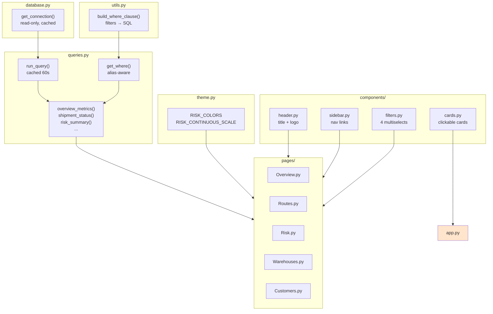

# Streamlit Dashboard

Interactive business intelligence on top of the `delivery_performance` mart. Five analytical pages, one shared filter system, and a single wide-table query layer.

For the big picture, see the [root README](../README.md) and [architecture doc](../docs/architecture.md).

---

## Overview



---

## The five pages

### `app.py` — Home

Landing page. KPI cards (shipments, customers, warehouses, avg risk), clickable navigation cards to the other pages, an architecture summary, and the tech stack.

### `pages/Overview.py` — Executive Overview

The "what's happening?" page.

- **KPIs:** shipments, customers, warehouses, high-risk count, avg distance, avg delivery hours, avg weight, avg risk score
- **Charts:** shipment status pie, priority bar, shipment timeline, package size distribution, warehouse volume, risk distribution

**Audience:** executives, operations managers.

### `pages/Routes.py` — Route Analytics

The "how are we moving things?" page.

- **KPIs:** total routes, avg distance, avg delivery time, effective fleet speed
- **Charts:** transport efficiency, distance histogram, distance vs time scatter, longest routes table, routes by warehouse
- **Map:** warehouse network with route volumes

**Audience:** logistics analysts.

### `pages/Risk.py` — Delivery Risk

The "what should we worry about?" page.

- **KPIs:** shipments analysed, avg risk score, highest score, high-risk count
- **Charts:** risk category pie (semantic colors), risk score histogram, avg risk by warehouse, temperature vs risk scatter
- **Table:** top 50 highest-risk shipments

**Audience:** risk managers, operations leads.

### `pages/Warehouses.py` — Warehouse Analytics

The "how are the facilities performing?" page.

- **KPIs:** active warehouses, total shipments, avg distance, avg risk
- **Charts:** shipment volume by warehouse, avg risk by warehouse, distance vs time scatter
- **Capacity:** relative utilisation index
- **Map:** warehouse locations

**Audience:** warehouse managers.

### `pages/Customers.py` — Customer Analytics

The "who are we shipping for?" page.

- **KPIs:** customers, shipments, avg package weight
- **Charts:** shipments by country, top customers, package preferences, order status pie
- **Map:** customer distribution across Europe

**Audience:** customer success, sales.

---

## The filter system

Every page shares the same four filters, rendered in the sidebar.

| Filter | Source | Column |
|--------|--------|--------|
| Warehouse | `warehouses.name` | `warehouse_id` |
| Status | `delivery_performance.status` | `status` |
| Priority | `delivery_performance.priority` | `priority` |
| Risk | `delivery_performance.risk_category` | `risk_category` |

**How filters flow:**

```python
# In every page:
filters = render_filters()          # returns dict of selections
where   = get_where(filters)        # builds SQL WHERE clause

run_query(f"""
    SELECT ...
    FROM delivery_performance
    {where}
""")
```

**Session state persistence:** filter selections persist across page navigation via `st.session_state`. Select "Amsterdam" on Overview, navigate to Risk, and the filter is still applied.

**Reset:** the "♻️ Reset Filters" button clears all selections by popping them from session state and rerunning.

---

## The query layer

### `database.py` — one connection, read-only

```python
@st.cache_resource
def get_connection() -> duckdb.DuckDBPyConnection:
    if not DB_PATH.exists():
        raise FileNotFoundError(...)
    return duckdb.connect(str(DB_PATH), read_only=True)
```

- **`@st.cache_resource`** — returns the same connection across reruns
- **`read_only=True`** — the dashboard cannot corrupt the warehouse
- **Existence check** — raises a helpful error if the pipeline hasn't run yet

### `queries.py` — cached queries

```python
@st.cache_data(ttl=60)
def run_query(sql: str):
    return get_connection().sql(sql).df()
```

- **`@st.cache_data(ttl=60)`** — same SQL string returns cached results for 60 seconds
- **`.df()`** — returns pandas (DuckDB's `.df()` method)

**Named queries** wrap common patterns:

```python
def overview_metrics(filters): ...
def shipment_status(filters): ...
def risk_summary(filters): ...
def warehouse_performance(filters): ...
def route_performance(filters): ...
def top_customers(filters): ...
```

Each named query accepts `filters` and passes them through `get_where()`.

### `utils.py` — the WHERE-clause builder

```python
def build_where_clause(filters: dict | None, alias: str = "") -> str:
    """Build a WHERE clause from the filter dict.
    alias prefixes every column reference for JOIN safety."""
```

**The `alias` parameter** prevents ambiguity in multi-table queries. Without it, a query that joins `warehouses` and `delivery_performance` fails with `Binder Error: Ambiguous reference to column name "warehouse_id"`.

Example output:

```python
build_where_clause({"warehouses": ["Amsterdam Distribution Centre"]}, alias="d")
# → "WHERE d.warehouse_id IN (SELECT warehouse_id FROM warehouses WHERE name IN ('Amsterdam Distribution Centre'))"
```

---

## Design decisions

### One mart, not many joins

The dashboard only reads `delivery_performance`. It's a wide table (~19 columns) that already has everything: order details, customer location, route info, weather, risk.

**Why?**
- **Fast** — no joins on page load
- **Simple** — page queries are single-table
- **Consistent** — same numbers everywhere

**Trade-off:** `delivery_performance` has to be materialized on every `dbt run`. For 300 rows that's free. For 300 million rows, you'd want incremental materialization.

### Semantic risk colors

```python
RISK_COLORS = {
    "LOW":      "#2ECC71",   # green
    "MEDIUM":   "#F1C40F",   # yellow
    "HIGH":     "#E67E22",   # orange
    "CRITICAL": "#E74C3C",   # red
}
```

Same colors across every page. A user who sees the Risk page and then navigates to Overview recognizes HIGH as orange without thinking.

**Not automatic.** Plotly would assign arbitrary colors without an explicit `color_discrete_map`.

### No data caching across users

`@st.cache_data(ttl=60)` caches within a session for 60 seconds. Multi-user Streamlit deployments would need `st.cache_data(ttl=..., persist=...)` or Redis backing. Not needed for a local portfolio project.

### Empty-state guards

Every page checks `int(metrics.shipments) == 0` after the KPI query and stops with a warning. Without this, formatting `None` as `f"{x:.1f}"` would crash.

---

## Running the dashboard

```bash
cd dashboard
streamlit run app.py
```

Opens at `http://localhost:8501`.

**From the project root:**

```bash
streamlit run dashboard/app.py
```

**Note on running from the root:** `app.py` inserts its own directory into `sys.path` so imports work regardless of CWD:

```python
sys.path.insert(0, str(Path(__file__).parent))
```

---

## Screenshots

*(Placeholder — add screenshots to `docs/images/` and reference them here.)*

```markdown

*The Executive Overview page showing KPIs, status distribution, and shipment timeline.*


*The Delivery Risk page with the 4-tier risk distribution and weather impact.*


*Transport mode efficiency and route distance distribution.*
```

---

## How to add a new page

**1. Create `pages/YourPage.py`:**

```python
import sys
from pathlib import Path
import streamlit as st
import plotly.express as px

sys.path.insert(0, str(Path(__file__).parent.parent))

from queries import get_where, run_query
from components.filters import render_filters
from components.sidebar import render_sidebar
from theme import RISK_COLORS

st.title("📦 Your Page Title")

render_sidebar()
filters = render_filters()

where = get_where(filters)

metrics = run_query(f"""
    SELECT COUNT(*) AS n
    FROM delivery_performance
    {where}
""").iloc[0]

if int(metrics.n) == 0:
    st.warning("No data matches the current filters.")
    st.stop()

# ... your KPIs and charts ...
```

**2. Add the page to `theme.py`'s `PAGES` list** so the sidebar and landing cards pick it up:

```python
PAGES = [
    ...,
    ("pages/YourPage.py", "Your Page", "📦"),
]
```

**3. Add a card to `app.py`** if you want it on the landing page.

That's it — Streamlit auto-discovers pages in `pages/`.

---

## Further reading

- [`docs/architecture.md`](../docs/architecture.md) — medallion design
- [`docs/data-dictionary.md`](../docs/data-dictionary.md) — column reference
- [Streamlit docs](https://docs.streamlit.io/) — upstream
- [Plotly Express docs](https://plotly.com/python/plotly-express/) — chart reference