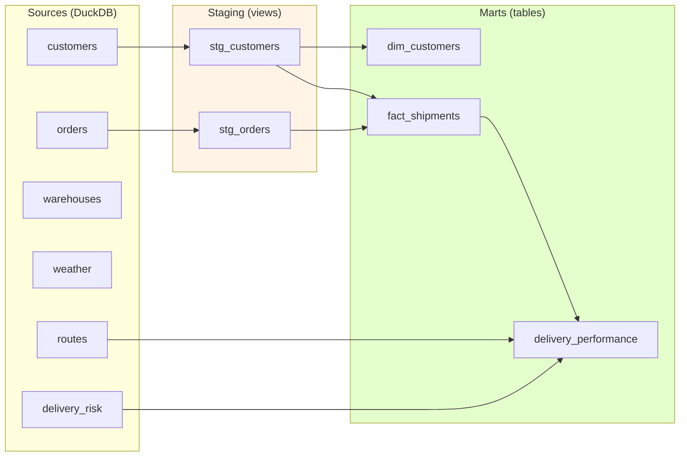

# dbt Analytics Layer

The transformation layer between the raw warehouse and the dashboard. Every model is a SQL file, every model has a purpose, and every important column has a test.

For the big picture, see the [root README](../../README.md) and [architecture doc](../../docs/architecture.md).

---

## The shape of it



**Two layers, one direction.** Staging cleans. Marts model. Nothing in marts reads a source directly — everything goes through staging or a mart.

---

## Staging models

Staging models are **views** — cheap, always fresh, no materialization cost.

### `stg_customers`

```sql
select
    customer_id, first_name, last_name, email,
    city, state, country, latitude, longitude
from {{ source('shipping', 'customers') }}
```

**Purpose:** Column selection. The raw `customers` table has 17 columns; the dimension needs 9. Staging strips what downstream doesn't use.

**Why not put this in `dim_customers`?** Because if the source schema changes, you want to fix it in one place — the staging layer — not in every mart that reads it.

### `stg_orders`

```sql
select
    order_id, customer_id, warehouse_id,
    package_weight_kg, package_size, priority, status, created_at
from {{ source('shipping', 'orders') }}
```

**Purpose:** Column selection. Preserves `created_at` as-is — the rename to `order_date` happens in the fact table where it's business-relevant.

---

## Mart models

Marts are **tables**. They're queried heavily by the dashboard, so materialization matters.

### `dim_customers`

Customer dimension.

```sql
{{ config(materialized='table') }}

select
    customer_id, first_name, last_name, email,
    city, state, country, latitude, longitude
from {{ ref('stg_customers') }}
```

**Why a dimension if it's the same as staging?** Two reasons:
1. It's the **join target** for fact tables — having a named `dim_customers` makes the star schema explicit
2. It's where SCD columns would go if you ever added history (valid_from, valid_to, is_current)

**Tests:** `unique` + `not_null` on `customer_id`; `not_null` on `country`.

### `fact_shipments`

Shipment fact table. One row per order.

```sql
{{ config(materialized='table') }}

select
    o.order_id,
    o.customer_id,
    o.warehouse_id,
    o.created_at as order_date,
    o.package_weight_kg,
    o.package_size,
    o.priority,
    o.status,
    c.city    as customer_city,
    c.country as customer_country
from {{ ref('stg_orders') }} o
left join {{ ref('stg_customers') }} c
    on o.customer_id = c.customer_id
```

**Purpose:** Denormalize the customer location onto the order. This is what makes the mart queryable without joins.

**The `left join`** preserves all orders even if a customer is missing. In practice no orders are orphaned, but defensive joins prevent silent row loss.

**Tests:** `unique` + `not_null` on `order_id`; `not_null` on `customer_id`, `warehouse_id`; `relationships` on `customer_id → dim_customers`; `accepted_values` on `status`.

### `delivery_performance`

The "answer" mart. One row per order, fully enriched.

```sql
{{ config(materialized='table') }}

select
    f.order_id,
    f.customer_id,
    f.warehouse_id,
    f.order_date,
    f.status,
    f.package_weight_kg,
    f.package_size,
    f.priority,
    f.customer_city,
    f.customer_country,
    r.route_id,
    r.distance_km,
    r.estimated_hours   as estimated_delivery_hours,
    r.transport_mode,
    dr.temperature,
    dr.wind_speed,
    dr.risk_score,
    dr.risk_level       as risk_category
from {{ ref('fact_shipments') }}                     f
left join {{ source('shipping', 'routes') }}         r  on f.order_id = r.order_id
left join {{ source('shipping', 'delivery_risk') }} dr  on f.order_id = dr.order_id
```

**Purpose:** This is the *only* table the dashboard queries. Every dashboard page reads from `delivery_performance`.

**Why one wide table instead of joins in the dashboard?** Three reasons:
1. **Performance** — one table scan instead of three joins on every page load
2. **Simplicity** — dashboard queries are trivial `SELECT ... WHERE ... GROUP BY`, no join logic
3. **Consistency** — the same numbers appear on every page, computed the same way

**The two renames** (`estimated_hours` → `estimated_delivery_hours`, `risk_level` → `risk_category`) make the mart's API more descriptive than the source's.

**Tests:** `unique` + `not_null` on `order_id`; `not_null` on `customer_id`, `warehouse_id`, `risk_score`; `accepted_values` on `transport_mode`, `risk_category`.

---

## Test coverage

17 dbt tests across the two schema files.

**Not-null tests** (ensure critical columns have values):

| Model | Column |
|-------|--------|
| `dim_customers` | `customer_id`, `country` |
| `fact_shipments` | `order_id`, `customer_id`, `warehouse_id`, `order_date` |
| `delivery_performance` | `order_id`, `customer_id`, `warehouse_id`, `risk_score` |

**Unique tests** (ensure primary keys are keys):

| Model | Column |
|-------|--------|
| `dim_customers` | `customer_id` |
| `fact_shipments` | `order_id` |
| `delivery_performance` | `order_id` |

**Relationships tests** (referential integrity):

| From | To |
|------|-----|
| `fact_shipments.customer_id` | `dim_customers.customer_id` |

**Accepted-values tests** (catch enum drift):

| Model | Column | Values |
|-------|--------|--------|
| `fact_shipments` | `status` | `created, processing, shipped, delivered, cancelled` |
| `delivery_performance` | `transport_mode` | `van, truck, air` |
| `delivery_performance` | `risk_category` | `LOW, MEDIUM, HIGH, CRITICAL` |

**Why these specific tests?**

- **Uniqueness** catches duplicate primary keys (the classic 1:many bug)
- **Not-null** catches silent nulls from failed joins
- **Relationships** catches orphaned foreign keys
- **Accepted values** catches enum drift when a generator changes

Together they cover the four failure modes that actually break analytical models.

---

## Running dbt

```bash
cd dbt/shipping_analytics

# Run all models
dbt run

# Run tests
dbt test

# Generate docs (lineage graph)
dbt docs generate
dbt docs serve     # opens http://localhost:8080

# Run a single model
dbt run --select delivery_performance

# Run a model and its upstream dependencies
dbt run --select +delivery_performance

# Run a model and everything downstream
dbt run --select delivery_performance+
```

**From the project root:**

```bash
make dbt           # dbt run && dbt test
```

---

## Profile configuration

The dbt profile lives at `~/.dbt/profiles.yml` (not in the repo — it's environment-specific).

```yaml
shipping_analytics:
  target: dev
  outputs:
    dev:
      type: duckdb
      path: /absolute/path/to/ShippingDataPipeline/warehouse/shipping.duckdb
      threads: 1
```

**Points at the same DuckDB file the pipeline writes to.** That's why `dbt run` sees the pipeline's output.

**Single writer:** DuckDB can't have two write connections open at once. If you get `IO Error: Could not set lock on file`, it means the Streamlit dashboard (which opens a read-only connection) is holding the file. Stop the dashboard, run dbt, restart the dashboard.

---

## How to add a new model

**Say you want a `carrier_performance` mart** (average delivery time per carrier).

**1. Create the SQL file:**

```sql
-- models/marts/carrier_performance.sql
{{ config(materialized='table') }}

select
    c.carrier_id,
    c.name,
    count(dp.order_id)                   as shipments,
    avg(dp.estimated_delivery_hours)     as avg_hours,
    avg(dp.distance_km)                  as avg_distance
from {{ source('shipping', 'carriers') }} c
left join {{ ref('delivery_performance') }} dp
    on c.carrier_id = dp.carrier_id
group by c.carrier_id, c.name
order by shipments desc
```

**2. Add tests and descriptions to `schema.yml`:**

```yaml
- name: carrier_performance
  description: "Carrier-level shipment metrics"
  columns:
    - name: carrier_id
      description: "Unique carrier identifier"
      tests:
        - unique
        - not_null
    - name: shipments
      description: "Total shipments handled"
      tests:
        - not_null
```

**3. Run:**

```bash
dbt run --select carrier_performance
dbt test --select carrier_performance
```

That's it. dbt finds the new model, resolves its dependencies, and materializes it in order.

---

## Further reading

- [`docs/architecture.md`](../../docs/architecture.md) — why staging → marts
- [`docs/data-dictionary.md`](../../docs/data-dictionary.md) — column reference
- [dbt docs](https://docs.getdbt.com/) — upstream documentation