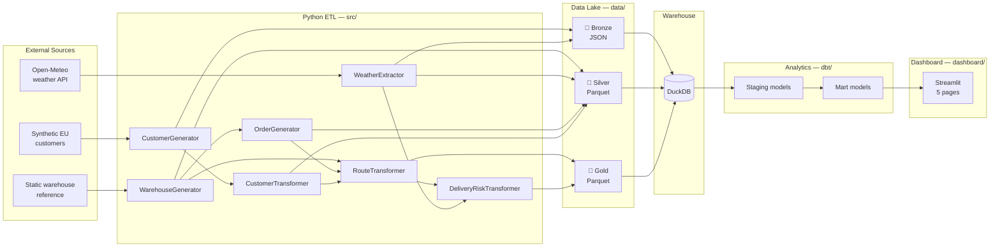
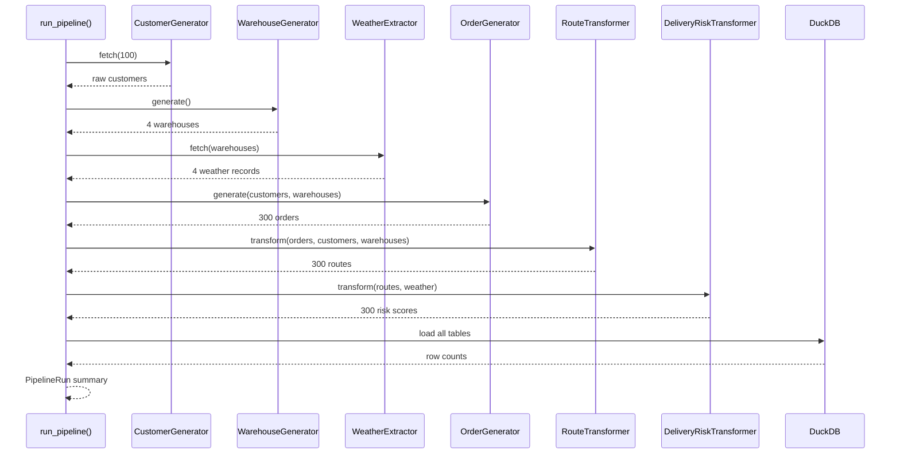
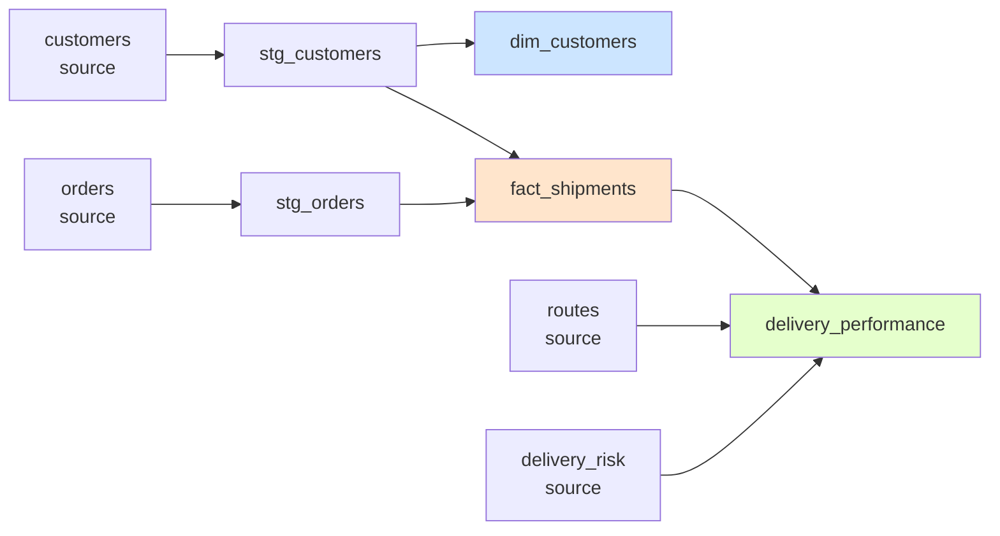

# Architecture

This document explains **how** the Shipping Analytics Data Platform is put together and **why** it's built the way it is.

For a quick overview, see the [root README](../README.md). For column-level details, see the [data dictionary](data-dictionary.md).

---

## High-level flow



---

## The pipeline, step by step

The pipeline is orchestrated by `src/pipeline.py:run_pipeline()`, which returns a `PipelineRun` summary — a dataclass containing one `StepResult` per step, with duration and row count.



**Why this order?**

1. **Customers first** — everything else references them
2. **Warehouses before weather** — weather is fetched per warehouse coordinate
3. **Warehouses before orders** — orders need a warehouse_id
4. **Routes after orders + customers + warehouses** — routes join all three
5. **Risk last** — it joins routes with weather

Any step that depends on another runs after it. No hidden ordering.

---

## The medallion layers

### 🥉 Bronze — preserve the raw truth

**Purpose:** keep an untouched record of what the source said, so you can always replay.

**What's stored:**
- `data/bronze/customers/customers_YYYYMMDD_HHMMSS_µs.json` — one file per generator run
- `data/bronze/weather/weather_YYYYMMDD_HHMMSS_µs.json` — one file per fetch

**Why timestamped, microsecond-precision filenames?** So two runs in the same second don't overwrite each other. This happened in practice — see the bronze directory listing if you're curious.

**What's *not* in bronze:**
- Orders and warehouses — these are *generated*, not fetched, so their "raw" form is the generated DataFrame. They go straight to silver.

This is a deliberate design choice: bronze is for **external** data. Synthetic data has no upstream to preserve.

### 🥈 Silver — clean, typed, deduplicated

**Purpose:** normalize types, flatten nesting, drop what doesn't matter.

**What's stored:**
- `data/silver/customers/customers.parquet` — 100 rows
- `data/silver/warehouses/warehouses.parquet` — 4 rows
- `data/silver/weather/weather.parquet` — 4 rows
- `data/silver/orders/orders.parquet` — 300 rows

**Format:** Parquet. Columnar, compressed, typed.

**Why silver for warehouses/orders?** Because there's no bronze for them — they're generated clean. Silver is their first home.

### 🥇 Gold — business-ready datasets

**Purpose:** contain answers, not ingredients.

**What's stored:**
- `data/gold/routes/routes.parquet` — 300 rows with distance, mode, duration
- `data/gold/delivery_risk/delivery_risk.parquet` — 300 rows with risk scores

**Why gold, not silver?** Because these aren't raw data — they're *computed* artifacts. A route isn't "in the source system." It's derived from customer coordinates, warehouse coordinates, and a haversine formula.

---

## Warehouse — DuckDB

**Location:** `warehouse/shipping.duckdb`

**Why DuckDB?**

- **Zero setup.** No server, no port, no credentials. One file.
- **Columnar + vectorized.** Analytical queries are fast.
- **SQL-compatible.** dbt works with it natively.
- **Inspectable.** Any DuckDB client (or `duckdb` CLI) opens the file directly.

**Why not Postgres / BigQuery / Snowflake?** Because the goal of this project is that **anyone can clone it and see real analytics in 30 seconds**. A server-based warehouse would be 10x more setup for the same result.

**Trade-off:** DuckDB is single-writer. Only one process can hold a write lock at a time. This shows up as a lock conflict if you try to `dbt run` while the dashboard is open. The fix is documented in [`.github/workflows/README.md`](../.github/workflows/README.md).

**How the pipeline writes:**

`WarehouseLoader` (in `src/warehouse/load.py`) is used as a context manager:

```python
with WarehouseLoader() as loader:
    for table_name in WAREHOUSE_TABLES:
        path = table_source_path(table_name)
        loader.load_table(table_name, path)
```

Every table is `CREATE OR REPLACE TABLE ... AS SELECT * FROM read_parquet(...)`. Full rebuild, every run. Idempotent by construction.

---

## The analytics layer (dbt)

**Structure:**

```
dbt/shipping_analytics/
├── models/
│   ├── staging/
│   │   ├── stg_customers.sql
│   │   ├── stg_orders.sql
│   │   └── schema.yml         # tests + descriptions
│   └── marts/
│       ├── dim_customers.sql
│       ├── fact_shipments.sql
│       ├── delivery_performance.sql
│       └── schema.yml
├── dbt_project.yml
└── profiles.yml (not in repo)
```

**The two layers:**

| Layer | Materialization | Purpose |
|-------|-----------------|---------|
| **Staging** | Views | Minimal cleanup — column selection, renames, type casts |
| **Marts** | Tables | Business logic — joins, aggregations, dimensional models |

**Why views for staging?** Because they're cheap, always fresh, and let you iterate without rebuilding. Marts are tables because the dashboard queries them constantly.

**Why not put everything in marts?** Separation. When a mart breaks, you want to know *which* layer broke: the source data (staging) or the business logic (marts).

**Lineage:**



---

## Design decisions with trade-offs

Every engineering choice involves trade-offs. Here are the significant ones.

### Vectorized Polars over row-by-row Python

**What we do:** every transformation is expressed as a `pl.Expr` — a lazy, vectorized operation.

**Why:** A Python loop over 300 rows is invisible. A Python loop over 300 million rows is a full-time job. Writing vectorized from day one means the code doesn't need rewriting when the dataset grows.

**Trade-off:** vectorized code is harder to read and debug. A `when/then/otherwise` chain is less intuitive than an `if` statement. The mitigation is thorough tests.

**Notable bug this caught:** the original risk scorer nested its `when/then/otherwise` chain in the wrong order, so only the *lowest* tier fired. Because every score was capped at 25, the CRITICAL category was unreachable. Vectorization made this visible — the whole distribution was wrong in a way a unit test could pin down.

### Synthetic EU customers over randomuser.me

**What we did:** replaced the RandomUser API with a synthetic EU generator (30 cities across 17 countries).

**Why:** RandomUser returns globally distributed users. Combined with 4 European warehouses, that produced a **9,000 km average route distance** — physically absurd for a European logistics operation. The risk model became meaningless because most routes were intercontinental.

Switching to EU-only customers brought the average distance down to **1,051 km** — which is what intra-EU shipping actually looks like.

**Trade-off:** the project no longer demonstrates "external API integration" for customers. But it still does for weather (Open-Meteo), so that capability is still shown.

**Bonus:** synthetic customers are deterministic with `PIPELINE_SEED`, which makes the whole pipeline reproducible.

### Full rebuild every run, not incremental

**What we do:** `CREATE OR REPLACE TABLE` for every table, every run.

**Why:** The pipeline runs in ~10 seconds. There's no data volume that would make incremental loads worthwhile, and full rebuilds are **trivially idempotent** — you can run the pipeline 100 times and get the same result.

**Trade-off:** doesn't demonstrate incremental strategy (dbt's `is_incremental()`, watermarking, dedup keys). If you needed to demonstrate that, you'd add it in `fact_shipments` where the volume justifies it. For 300 rows, it's over-engineering.

### Risk scoring: rules-based, not ML

**What we do:** distance + duration + weather each contribute points through tiered thresholds.

**Why:** Rules are **explainable**. A reviewer can see why a route is HIGH — 15 points for distance, 25 for duration, 10 for weather. An ML model would need training data, feature engineering, and evaluation — a whole separate project.

**Trade-off:** the risk model isn't "learned." It represents domain intuition, not empirical reality. That's fine for a portfolio project but would need to be replaced in a real system.

---

## Failure modes and how they're handled

| Failure | Handling |
|---------|----------|
| Open-Meteo unreachable | Retries are configured; single-run failure logs and continues |
| Missing weather for a warehouse | Risk score applies a **penalty** (`UNKNOWN_WEATHER_PENALTY = 15`) rather than assuming zero risk |
| Duplicate warehouse coords | Haversine returns 0; route still valid |
| Parquet schema drift | dbt tests catch it at the staging layer |
| Dashboard queries with ambiguous columns | Filter builder takes a table alias — see `dashboard/utils.py` |
| DuckDB lock conflict (dbt vs dashboard) | Documented — stop the dashboard before `dbt run` |
| Test failures in CI | GitHub Actions fails the PR; coverage uploaded for diff |

---

## Further reading

- [Data dictionary](data-dictionary.md) — every column, every table
- [`src/README.md`](../src/README.md) — backend module breakdown
- [`dbt/shipping_analytics/README.md`](../dbt/shipping_analytics/README.md) — model documentation
- [`dashboard/README.md`](../dashboard/README.md) — UI architecture
- [`tests/README.md`](../tests/README.md) — testing philosophy