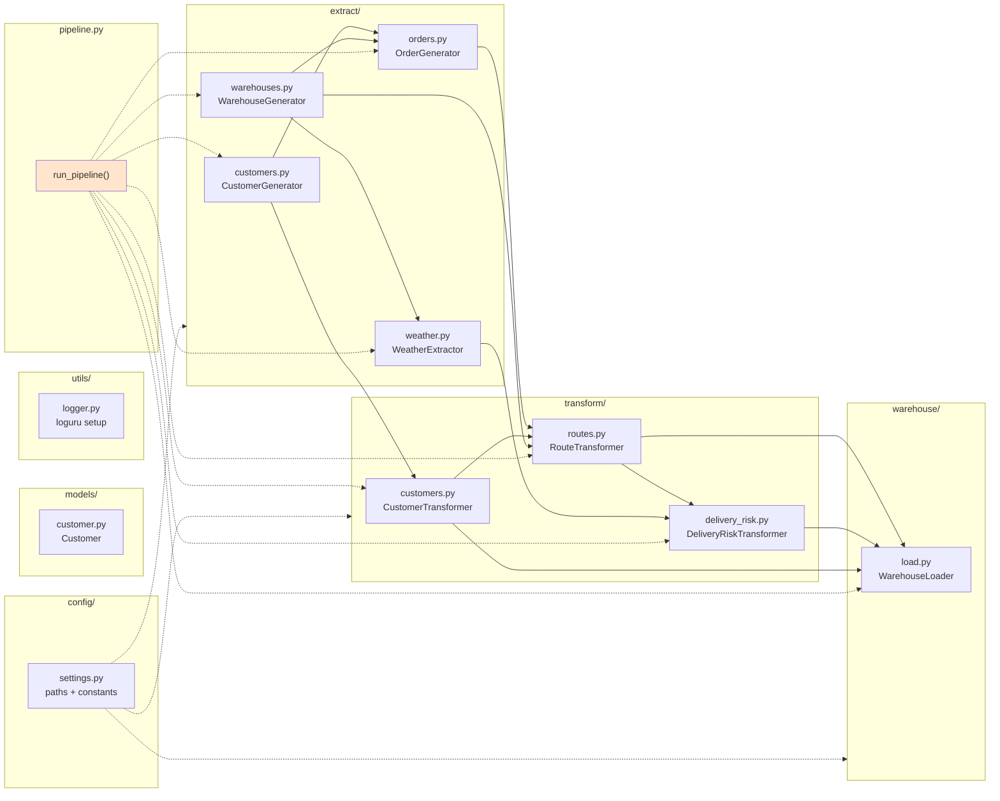

# `src/` — Backend ETL Pipeline

The Python ETL layer. This module reads from external sources, transforms data through the medallion layers, and loads it into DuckDB.

For the big picture, see the [root README](../README.md) and [architecture doc](../docs/architecture.md).

---

## Overview



---

## Module-by-module

### `config/settings.py`

All paths and constants in one place. Nothing is hardcoded elsewhere.

**Paths:**

```python
PROJECT_ROOT   = Path(__file__).resolve().parents[2]
DATA_DIR       = PROJECT_ROOT / "data"
BRONZE_DIR     = DATA_DIR / "bronze"
SILVER_DIR     = DATA_DIR / "silver"
GOLD_DIR       = DATA_DIR / "gold"
WAREHOUSE_DIR  = PROJECT_ROOT / "warehouse"
DUCKDB_PATH    = WAREHOUSE_DIR / "shipping.duckdb"
DBT_DIR        = PROJECT_ROOT / "dbt" / "shipping_analytics"
DASHBOARD_DIR  = PROJECT_ROOT / "dashboard"
```

**Pipeline defaults:**

```python
DEFAULT_CUSTOMER_COUNT     = 100
DEFAULT_WAREHOUSE_COUNT    = 4
DEFAULT_ORDERS_PER_CUSTOMER = 3
PIPELINE_SEED              = None  # set to an int for reproducible runs
```

**Warehouse table registry:**

```python
WAREHOUSE_TABLES = {
    "customers":     ("silver", "customers",     "customers.parquet"),
    "warehouses":    ("silver", "warehouses",    "warehouses.parquet"),
    "weather":       ("silver", "weather",       "weather.parquet"),
    "orders":        ("silver", "orders",        "orders.parquet"),
    "routes":        ("gold",   "routes",        "routes.parquet"),
    "delivery_risk": ("gold",   "delivery_risk", "delivery_risk.parquet"),
}
```

This registry is the single source of truth for "what tables does the warehouse have?" Both `WarehouseLoader` and the pipeline consume it. Adding a table means editing one dict.

---

### `extract/` — bring in raw data

Four extractors, two patterns.

**Pattern A: API-backed extractors** (fetch external data)

```python
class WeatherExtractor:
    def fetch(self, warehouses_df) -> list[dict]: ...
    def save_raw(self, data) -> Path: ...
    def transform(self, data) -> pl.DataFrame: ...
    def save(self, df, output_dir=None) -> Path: ...
```

**Pattern B: synthetic generators** (produce data)

```python
class CustomerGenerator:
    def fetch(self, count) -> dict: ...
    def save_raw(self, data) -> Path: ...

class WarehouseGenerator:
    def generate(self, count=DEFAULT_WAREHOUSE_COUNT) -> pl.DataFrame: ...
    def save(self, df) -> Path: ...

class OrderGenerator:
    def generate(self, customers_df, warehouses_df, orders_per_customer=3) -> pl.DataFrame: ...
    def save(self, df) -> Path: ...
```

**Why the split?**

- **API extractors** save to bronze *and* transform — because raw API responses are worth keeping and are verbose
- **Synthetic generators** save only to silver — because generated data has no upstream to preserve

**`extract/customers.py`**

Produces 100 synthetic EU customers from a 30-city catalog. Uses a jittered coordinate offset (±0.25°) so customers in the same city don't share a location.

**`extract/warehouses.py`**

Static reference data — 4 warehouses across Amsterdam, Berlin, Paris, Madrid. The `generate(count=...)` parameter slices the list.

**`extract/weather.py`**

Fetches latest weather from Open-Meteo for each warehouse's coordinates. Mocked in tests (`tests/test_weather.py`).

**`extract/orders.py`**

Generates 3 orders per customer with random weights, sizes, priorities, statuses. Uses UUIDs for `order_id`.

---

### `transform/` — make the data analytical

Three transformers, all vectorized with Polars.

**`transform/customers.py`**

Validates records through the Pydantic `Customer` model, then builds a DataFrame. Near-pass-through, but the Pydantic validation catches schema drift.

**`transform/routes.py`**

The most computational transformer. Joins orders → customers → warehouses, computes haversine distance, assigns transport mode, derives estimated hours.

**Key methods:**

```python
@staticmethod
def _haversine_expr(lat1, lon1, lat2, lon2) -> pl.Expr:
    """Vectorized great-circle distance."""

@staticmethod
def _transport_mode_expr(distance_col) -> pl.Expr:
    """Distance-based mode assignment."""

@staticmethod
def _estimated_hours_expr(distance_col, mode_col) -> pl.Expr:
    """Mode-specific speed + handling."""
```

**None of these use Python loops.** The whole transformation is a chain of `pl.when/then/otherwise` expressions.

**`transform/delivery_risk.py`**

Computes risk scores. Takes routes + weather, produces `risk_score` and `risk_level`.

The scoring uses four independent factors:

```python
DISTANCE_TIERS_KM   = [(5_000, 15), (10_000, 25), (15_000, 35)]
DURATION_TIERS_H    = [(18, 5), (36, 15), (72, 25)]
TEMPERATURE_TIERS_C = [(25, 10), (30, 20)]
WIND_TIERS_KMH      = [(8, 5), (15, 15)]
```

Each tier is `(lower_bound_exclusive, points)`, sorted low→high. The last matching tier wins. Missing weather applies a penalty (`UNKNOWN_WEATHER_PENALTY = 15`) rather than assuming zero risk.

---

### `warehouse/load.py`

Loads all Parquet files into DuckDB.

```python
class WarehouseLoader:
    def __init__(self, db_path: Path | str | None = None) -> None: ...
    def __enter__(self) -> "WarehouseLoader": ...
    def __exit__(self, *exc) -> None: ...

    def load_table(self, table_name: str, parquet_path: str | Path) -> int:
        """Replace <table_name> with the contents of <parquet_path>.
        Returns the row count."""
```

**Design decisions:**

- **Context manager** — guarantees the connection closes, even on exception
- **Whitelist check** — refuses to load a table name that isn't registered in `WAREHOUSE_TABLES`. Catches typos before they create orphan tables
- **Parameterized path** — uses `read_parquet(?)` instead of f-string interpolation
- **Row count returned** — feeds the `PipelineRun` summary

---

### `models/customer.py`

Flat Pydantic v2 model. Replaced the old nested-RandomUser model when customers became synthetic.

```python
class Customer(BaseModel):
    model_config = ConfigDict(extra="ignore")

    customer_id: str
    title: str
    first_name: str
    last_name: str
    gender: str
    email: str
    phone: str
    street_number: int
    street_name: str
    city: str
    state: str
    country: str
    postcode: str
    latitude: float
    longitude: float
    registered_date: str
    nationality: str
```

**Why `extra="ignore"`?** If a future version of the generator adds a field, the model doesn't break — it just ignores it. This is the opposite of the RandomUser model's problem, where any API change would break validation.

---

### `utils/logger.py`

Loguru-based logging, configured once. Uses a stdout sink with a structured format. See [`docs/architecture.md`](../docs/architecture.md) for how logging is used across the pipeline.

---

### `pipeline.py`

The orchestration layer. The only module that knows the full sequence.

```python
def run_pipeline(seed: int | None = PIPELINE_SEED) -> PipelineRun:
    """Run the full end-to-end pipeline."""
```

**Returns** a `PipelineRun` dataclass:

```python
@dataclass
class StepResult:
    name: str
    duration_s: float
    rows: int | None = None
    path: str | None = None

@dataclass
class PipelineRun:
    steps: list[StepResult]
    @property
    def total_duration_s(self) -> float: ...
```

**Why a return value?**

- Airflow can consume it as an XCom
- Tests can assert row counts without parsing log output
- A CLI can pretty-print it
- A future dashboard could display "last run" metadata

**Steps:** the pipeline runs 6 named steps plus 6 warehouse loads, all timed.

```python
customers      →  1.5s
warehouses     →  0.0s
weather        →  3.7s   (HTTP call to Open-Meteo)
orders         →  0.0s
routes         →  0.4s
delivery_risk  →  0.1s
load:customers     →  0.1s
load:warehouses    →  0.1s
load:weather       →  0.1s
load:orders        →  0.1s
load:routes        →  0.1s
load:delivery_risk →  0.1s
─────────────────────────
Total          →  ~10s
```

---

## Design philosophy

### Vectorize everything

Every transformation is a `pl.Expr`. No `iter_rows`, no list comprehension over DataFrames, no Python loops in the hot path.

The one place a Python loop exists is `CustomerGenerator._make_customer()` — and that's fine, because it's constructing records, not transforming them.

### Validate at the boundary

Pydantic validates customer records on the way in. If the generator produces a malformed record, the transformer raises before the bad data reaches Parquet.

### Configuration over hardcoding

`WAREHOUSE_TABLES`, `DEFAULT_*` counts, and `PIPELINE_SEED` all live in `settings.py`. Adding a table or changing a count is a one-line change.

### Return values, not side effects

`run_pipeline()` returns a `PipelineRun`. `load_table()` returns a row count. `transform()` returns a DataFrame. Every function that does work tells you what it did.

---

## How to add a new extractor

Say you want to add a **carriers** extractor (a new data source).

**1. Create the file:**

```python
# src/extract/carriers.py
from pathlib import Path
import polars as pl
from src.config.settings import SILVER_DIR
from src.utils.logger import logger

class CarrierGenerator:
    """Generate synthetic carrier reference data."""
    CARRIERS = [
        {"carrier_id": "C-001", "name": "FastFreight", "mode": "truck"},
        ...
    ]

    def generate(self) -> pl.DataFrame:
        df = pl.DataFrame(self.CARRIERS)
        logger.info(f"Generated {df.height} carriers")
        return df

    def save(self, df: pl.DataFrame) -> Path:
        output_dir = SILVER_DIR / "carriers"
        output_dir.mkdir(parents=True, exist_ok=True)
        output_file = output_dir / "carriers.parquet"
        df.write_parquet(output_file)
        logger.info(f"Saved carriers: {output_file}")
        return output_file
```

**2. Register the table:**

```python
# src/config/settings.py
WAREHOUSE_TABLES = {
    ...,
    "carriers": ("silver", "carriers", "carriers.parquet"),
}
```

**3. Wire it into the pipeline:**

```python
# src/pipeline.py
def step_carriers() -> pl.DataFrame:
    generator = CarrierGenerator()
    df = generator.generate()
    generator.save(df)
    return df

def run_pipeline(seed=None) -> PipelineRun:
    ...
    carriers_df = _timed(run, "carriers", step_carriers)
    ...
```

**4. Add tests:**

```python
# tests/test_carriers.py
def test_generate_returns_dataframe():
    df = CarrierGenerator().generate()
    assert isinstance(df, pl.DataFrame)

def test_carrier_ids_are_unique():
    df = CarrierGenerator().generate()
    assert df["carrier_id"].n_unique() == df.height
```

The loader picks up the new table automatically because it iterates `WAREHOUSE_TABLES`. dbt can now reference it via `{{ source('shipping', 'carriers') }}`.

---

## Running

```bash
# Full pipeline
python -m src.pipeline

# From the project root
make pipeline

# With a fixed seed (reproducible)
python -c "from src.pipeline import run_pipeline; run_pipeline(seed=42)"
```

---

## Further reading

- [`docs/architecture.md`](../docs/architecture.md) — medallion design rationale
- [`docs/data-dictionary.md`](../docs/data-dictionary.md) — column reference
- [`tests/README.md`](../tests/README.md) — how `src/` is tested