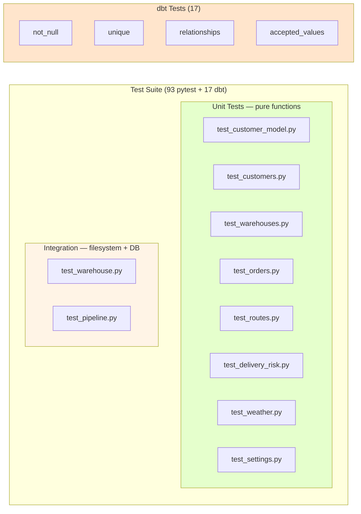

# Testing

Every layer of the pipeline is tested. If you change something and don't break a test, either the change is trivial or the test suite has a gap.

For the big picture, see the [root README](../README.md).

---

## Overview



---

## Test files

### Pure unit tests

| File | Tests | Covers |
|------|-------|--------|
| `test_customer_model.py` | 11 | Pydantic validation, coercion, extra-field handling |
| `test_customers.py` | 8 | Generator + transformer |
| `test_warehouses.py` | 4 | Generator + `count` parameter |
| `test_orders.py` | 10 | Order generation, referential integrity |
| `test_routes.py` | 15 | Haversine, mode assignment, duration formula, `route_id` derivation |
| `test_delivery_risk.py` | 15 | Tier composition, score capping, missing-weather handling |
| `test_weather.py` | 7 | `fetch()` mock, transform, save round-trip |
| `test_settings.py` | 10 | Path constants, defaults |

### Integration tests (filesystem + DuckDB)

| File | Tests | Covers |
|------|-------|--------|
| `test_warehouse.py` | 5 | Loader lifecycle, table replacement, whitelist |
| `test_pipeline.py` | 5 | `PipelineRun` container, structural |

**Total: 93 pytest tests + 17 dbt tests = 110 tests.**

---

## What we test — and why

### We test behavior, not implementation

`test_routes.py` doesn't test `_haversine_expr` directly. It calls `transform()` with coordinates and asserts the resulting distance is between 565 and 590 km.

**Why?** Because if you refactored `_haversine_expr` to use a different earth radius model, the behavior would still be correct — and the test would still pass.

**Anti-pattern:** `assert RouteTransformer._haversine_expr.__name__ == "_haversine_expr"` — tests that assert *how* rather than *what* are brittle.

### We test boundaries

Every tier-based transformation has a boundary case:

- Distance = 0 (identical coordinates) → distance 0
- Distance = 500 km → still `van`
- Distance = 500.01 km → becomes `truck`
- Unknown weather → penalty applied, not zero

Boundary bugs are the most common source of subtle errors. Testing them explicitly catches regressions.

### We test that the pipeline is deterministic

`test_routes.py::test_route_id_is_deterministic` builds the same route twice and asserts the same `route_id`. This would have caught the original random-int `route_id` bug where 20 routes in a batch could have colliding IDs.

### We mock external APIs

`test_weather.py::test_fetch_makes_one_request_per_warehouse` patches `requests.get` and asserts the mock was called exactly twice (once per warehouse). No actual HTTP request is made.

**Why?** Because tests that hit real APIs are flaky, slow, and fail on network outages. Mocking makes them deterministic and fast.

### We test the shape, not the values

`test_delivery_risk.py::test_risk_level_is_always_a_valid_category` doesn't assert "this specific input produces MEDIUM." It asserts "whatever the input is, the output is one of the four valid categories."

**Why?** Because the risk thresholds might legitimately change. A test that asserts `score == 55` breaks every time you tune the model. A test that asserts `level in {LOW, MEDIUM, HIGH, CRITICAL}` doesn't.

**Exception:** `test_score_matches_tier_composition` does assert exact values — but it computes the expected value from the source-of-truth tier constants:

```python
expected = (
    _tier_points(DISTANCE_TIERS_KM, distance)
    + _tier_points(DURATION_TIERS_H, hours)
    + _tier_points(TEMPERATURE_TIERS_C, temp)
    + _tier_points(WIND_TIERS_KMH, wind)
)
assert result["risk_score"][0] == expected
```

This breaks if the *logic* changes, but not if the *tuning constants* change.

---

## The `conftest.py` fixtures

Shared fixtures live in `tests/conftest.py`.

| Fixture | Provides |
|---------|----------|
| `sample_customers` | 2-row customer DataFrame |
| `sample_warehouses` | 2-row warehouse DataFrame |
| `sample_orders` | 2-row orders DataFrame |
| `sample_weather` | 2-row weather DataFrame |
| `warehouses` | 4-row generated warehouse DataFrame |
| `sandbox_data_dirs` | Redirects `BRONZE_DIR`/`SILVER_DIR`/`GOLD_DIR` to `tmp_path` |
| `sandbox_duckdb` | Redirects `DUCKDB_PATH` to a temp file |

**`sandbox_data_dirs` and `sandbox_duckdb`** are the important ones. Without them, tests would write to the real `data/` and `warehouse/` directories, polluting the workspace and potentially conflicting with a running pipeline.

**How it works:**

```python
@pytest.fixture
def sandbox_data_dirs(tmp_path, monkeypatch):
    bronze = tmp_path / "bronze"
    silver = tmp_path / "silver"
    gold   = tmp_path / "gold"

    for name, value in (
        ("BRONZE_DIR", bronze),
        ("SILVER_DIR", silver),
        ("GOLD_DIR",   gold),
    ):
        monkeypatch.setattr(f"src.config.settings.{name}", value)
        for mod in ("src.extract.customers", "src.extract.weather", ...):
            monkeypatch.setattr(f"{mod}.{name}", value, raising=False)

    yield {"bronze": bronze, "silver": silver, "gold": gold}
```

Monkeypatching each module's imported constant is verbose but necessary — when a module does `from src.config.settings import SILVER_DIR`, it binds a *copy* of the value, so patching only `settings.SILVER_DIR` doesn't help.

---

## Integration tests

The `@pytest.mark.integration` marker isolates full-pipeline tests that:
- Run the entire pipeline end-to-end
- Write to sandboxed directories
- Take several seconds instead of milliseconds

**They're skipped by default:**

```bash
pytest tests/                    # skips integration
pytest tests/ -m integration     # only integration
pytest tests/ -m "not integration"  # explicitly skips
```

**CI runs both:** the `test` job runs `pytest tests/` and the `integration` job runs `pytest tests/ -m integration`.

**Why separate them?** Local development should be fast. `pytest tests/` takes ~5 seconds. Adding the integration test triples that. Keeping it opt-in means the fast suite stays the default.

---

## Running tests

```bash
# From project root
make test                          # pytest, excludes integration
make test-cov                      # pytest + coverage
make integration                   # only integration tests

# Direct pytest
pytest tests/ -v                   # verbose
pytest tests/ -v -x                # stop on first failure
pytest tests/test_routes.py -v     # one file
pytest tests/ -k "haversine"       # tests matching a pattern

# Coverage
pytest tests/ --cov=src --cov-report=term-missing
pytest tests/ --cov=src --cov-report=html
open htmlcov/index.html
```

**Expected output:**

```
93 passed, 1 skipped in 5.54s
```

The skip is the integration test (marked, not run by default).

---

## The CI matrix

`.github/workflows/ci.yml` runs:

| Job | What |
|-----|------|
| `lint` | `ruff check` + `ruff format --check` |
| `test` | pytest on Python 3.11, 3.12, 3.13 |
| `dbt` | Full pipeline → `dbt run` → `dbt test` |
| `integration` | Full-pipeline pytest run |
| `ci-status` | Gate — fails if any job fails |

**Why the 3-version matrix?** Because `pyproject.toml` claims `requires-python = ">=3.11"`. If that claim is false, the matrix catches it.

**Why no 3.14?** Bleeding-edge. The `dbt-duckdb` package depends on a Pydantic-v1 shim that doesn't officially support 3.14. Adding 3.14 to the matrix would fail on the dbt job, not because of your code. Once upstream support lands, adding 3.14 is a one-line change.

---

## How to add a new test

**Say you want to test that `OrderGenerator` handles a single customer.**

**1. Add to the relevant file:**

```python
# tests/test_orders.py
def test_single_customer_produces_orders(sample_warehouses):
    single = pl.DataFrame({
        "customer_id": ["cust-001"],
        "first_name":  ["Solo"],
    })
    orders = OrderGenerator().generate(single, sample_warehouses, orders_per_customer=3)

    assert orders.height == 3
```

**2. Run it:**

```bash
pytest tests/test_orders.py::test_single_customer_produces_orders -v
```

**3. It's now part of CI.** No configuration needed — pytest discovers `test_*.py` files automatically.

**Guidelines:**

- Prefer behavior tests over implementation tests
- Use the fixtures in `conftest.py` where applicable
- Mark slow tests with `@pytest.mark.integration`
- If a test needs a new fixture, add it to `conftest.py`, not the test file

---

## Known gaps

**What's not tested:**

- **dbt model SQL syntax** — covered by `dbt run` in CI, but no unit tests for individual SQL files
- **Streamlit page rendering** — no UI tests. Could be added with `streamlit.testing.v1.AppTest`
- **Airflow DAG** — doesn't exist yet (roadmap item)
- **Containerization** — doesn't exist yet (roadmap item)

**What would you add first?**

1. **Streamlit smoke tests** — assert each page renders without error using `AppTest`
2. **dbt singular tests** — SQL-based tests for edge cases (`assert risk_score between 0 and 100`)
3. **Property-based tests** — `hypothesis` for the haversine function

---

## Further reading

- [pytest docs](https://docs.pytest.org/)
- [dbt testing docs](https://docs.getdbt.com/docs/build/tests)
- [`docs/architecture.md`](../docs/architecture.md) — design context